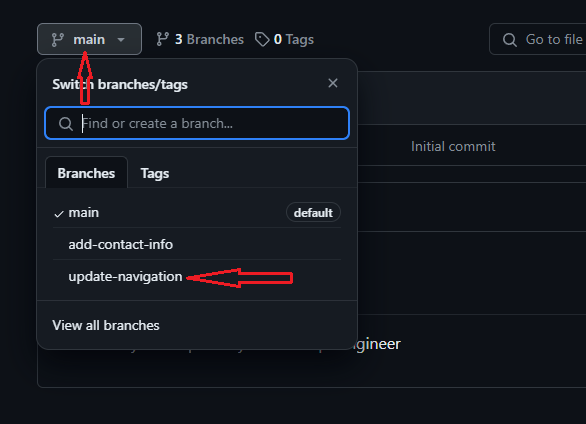
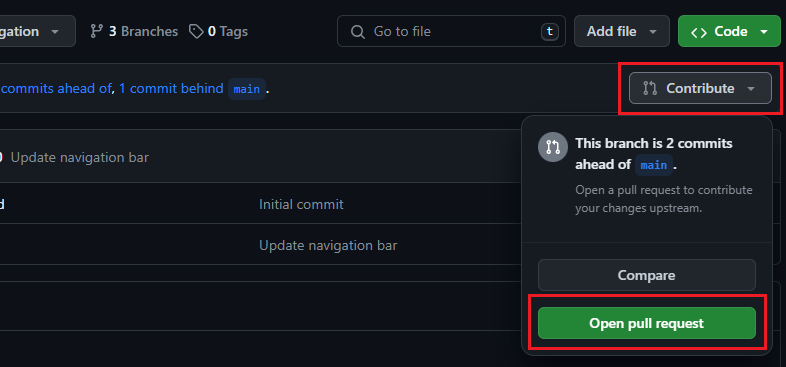
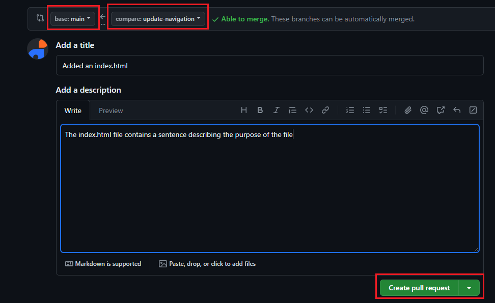

## 🧠 Understanding Pull Requests

A **Pull Request (PR)** is a request to merge changes from one branch into another (usually from a feature branch into the `main` branch). PRs help facilitate discussions, reviews, and conflict resolution before changes are merged into the main codebase.

---

## 🔧 How to Create a Pull Request on GitHub

Once **Tom** and **Jerry** have pushed their work to their respective branches, here’s how Tom would create a pull request:

### Tom’s Branch - `update-navigation`

---

### 🔹 1. Navigate to the GitHub Repository

Open your browser and go to the **GitHub repository**.

📸 Screenshot:
  


---

### 🔹 2. Switch to Tom’s Branch

Select the branch dropdown and switch to **Tom’s branch** (`update-navigation`).

📸 Screenshot:  
  


---

### 🔹 3. Create Pull Request

Click **"New Pull Request"** and ensure that the **Base branch** is set to `main` and the **Compare branch** is set to `update-navigation`.

📸 Screenshot:  
  


---

### 🔹 4. Review and Submit PR

After reviewing the changes, provide a descriptive title and description for the PR, and click **"Create pull request"**.

---

## ✅ Reviewing and Merging Tom’s Pull Request

Once the PR is created:

- Team members can review, comment, and approve it.
- After approval, click **"Merge pull request"** to merge Tom’s changes into the `main` branch.

📸 Screenshot of Merge Confirmation:  
  


---

## 🔁 Updating Jerry’s Branch with Latest Changes

Before merging Jerry’s work, ensure his branch is **up-to-date** with the latest changes from `main`. Here’s how you can do that:

### 🔹 1. Switch to Jerry’s Branch

Ensure you're working on **Jerry’s branch** (e.g., `add-contact-info`).

```bash
# Switch to Jerry's branch
git checkout add-contact-info
```

📸 Screenshot of Switching to Jerry’s Branch:  
  


---

### 🔹 2. Pull Latest Changes from Main

Pull the latest changes from the `main` branch into Jerry’s branch to ensure it includes all updates, including Tom’s work.

```bash
# Pull latest changes from main
git pull origin main
```

---

### 🔹 3. Resolve Any Merge Conflicts (if any)

If there are any merge conflicts between Jerry’s branch and the `main` branch, Git will notify you. Resolve these conflicts manually by editing the conflicting files. After resolving conflicts, stage and commit the changes:

```bash
# Stage and commit the resolved changes
git add .
git commit -m "Resolved merge conflicts"
```

📸 Screenshot of Resolving Merge Conflicts:  
  


---

### 🔹 4. Push Jerry’s Updated Branch

After successfully merging the changes from `main` into Jerry’s branch, push the updated branch to the remote repository:

```bash
# Push Jerry's updated branch
git push origin add-contact-info
```

---

### 🔹 5. Create Pull Request for Jerry

Once Jerry’s branch is updated, create a pull request for his branch:

- Go to the GitHub repository and click on **New pull request**.
- Select **Jerry’s branch** (`add-contact-info`) as the compare branch.
- Provide a title and description for the pull request.

📸 Screenshot of Creating Pull Request for Jerry:  
  


---

## ✅ Reviewing and Merging Jerry’s Pull Request

Once Jerry’s PR is created, team members can review, comment, and approve it.

- After approval, click **"Merge pull request"** to merge Jerry’s changes into the `main` branch.

📸 Screenshot of Merging Jerry's Pull Request:  
  


---

## Final Thoughts

By ensuring that both Tom’s and Jerry’s branches are kept up-to-date with the latest changes from `main`, conflicts are minimized, and the merging process becomes more efficient. This comprehensive workflow reflects a real-world collaborative development environment in GitHub.

---

**Repository URL**:  
https://github.com/suletetes/vprofile-project
This will confirm that the branches have been merged successfully, and the final changes are live.
